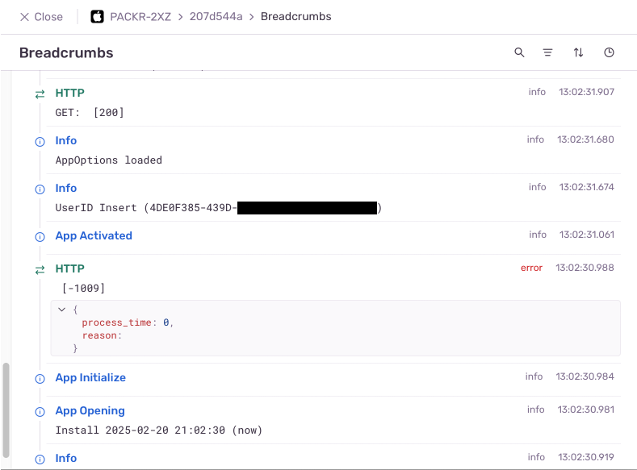

[](https://www.xojo.com/)


[](http://www.apple.com/ios/)

# Xojo Sentry Client
 API for using https://sentry.io

- Release date: 2023-01-10
- Latest update: 2025-02-20

Language: Xojo 2024r3 Desktop, Web & iOS Project

Author: Jeremie Leroy

Version 0.9

Based on the original code from Mike Cotrone https://github.com/mikecotrone/XojoSentryV2


## Overview
This is a full client written in Xojo for Sentry.io. The Sentry.io platform helps every developer diagnose, fix, and optimize the performance of their code. With Sentry, developers around the world save time, energy, and probably a few therapy sessions.


# Usage

Open one of the example projects

1. Copy/paste the Xojo_Sentry module into your project
2. Add Public Property sentry As SentryController to the App class
3. Copy/paste the code from App.Opening event into your project
4. Copy/paste the code from App.UnhandledException event into your project
5. Register for an account at https://sentry.io
6. You will get a project DSN from Sentry. Copy that value in the Sentry initialization code


## Sentry Options
After initiliazing Sentry, there are a few options that can be set.

```xojo
//If necessary, Sentry has a few options
self.sentry.Options.app_name = "" //Your app's name

'self.sentry.Options.get_battery_status = True //Only relevant on iOS
self.sentry.Options.include_StackFrame_address = False
self.sentry.Options.max_breadcrumbs = 100 //The maximum amount of breadcrumbs to keep
self.sentry.Options.persistant_breadcrumbs = 10 //The maximum amount of persistant breadcrumbs to keep. Defaults to 10
self.sentry.Options.sample_rate = 1.0 //Configures the sample rate for error events, in the range of 0.0 to 1.0. The default is 1.0 which means that 100% of error events are sent. If set to 0.1 only 10% of error events will be sent. Events are picked randomly.
self.sentry.Options.save_before_sending = False //Saves the exception to disk before sending to Sentry. Set to True before sending an UnhandledException or when the app is about to crash
self.sentry.Options.traces_sample_rate = 0.1 //Configures the sample rate for tracing events, in the range of 0.0 to 1.0. The default is 0.1 which means that 10% of traces events are sent. Traces are picked randomly.
```


## The User Object
Assign a SentryUser to your instance of SentryController to retrieve useful information about the user.

```xojo
//If your app handles user authentication add the info to sentry

Var user as new Xojo_Sentry.SentryUser
user.email = "name@example.com"
user.language = "en" //The language the user is running the app in
user.locale = locale.Current
'user.ip = "1.1.1.1" //Uncomment this if necessary. Default is "{{auto}}"
user.user_id = "1234" //The user's unique ID

self.sentry.user = user
```


| Parameter | Explanation |
| -- | -- |
| email | As String. The user's email address. |
| ip | As String. The user's IP address. Default is {{auto}}. |
| language | As String. The language used by the app when running on this user's device. |
| locale | As Locale. Defaults to `Locale.current` |
| subscription | As String. The user's current subscription status.  |
| user_id | As String. The user's unique identifier. |

Sentry will then display user's information in the Contexts area


## Submitting an Exception
Sending an exception to Sentry is a one line code:

```xojo
App.Sentry.SubmitException(exc, CurrentMethodName) 
```

Typically, you would wrap some code in a `Try... Catch` statement like this
```xojo
Try
  
  //Some code that may fail
  
  Dim dic As new Dictionary
  Dim value As String = dic.Value("foo")
  
Catch exc
  //Catch the exception and send to Sentry
  
  App.sentry.SubmitException(exc, CurrentMethodName)
  
  
End try
```

And add the following code in **App.UnhandledException** event:
```xojo
App.Sentry.SubmitException(exc, "", "", Xojo_Sentry.errorLevel.error)
```


## Adding more context to an Exception

Sentry allows many different pieces of context information to be added to an Exception.

### Tags

Xojo_Sentry allows two types of Tags. A global tag or a regular Tag.

**Adding Tags**

```xojo
App.Sentry.AddTag(key As String, value as String) // Adds a tag that lives until an exception is sent

App.Sentry.AddGlobalTag(key As String, value as String) // Adds a global tag that is persistant
```
**Removing Tags**

Remove tags by using one of these methods:

```xojo
App.Sentry.RemoveAllGlobalTags()
App.Sentry.RemoveAllTags()
```

### Extra key/values

`App.Sentry.AddExtraKeyValue(key as String, value as Variant)` Allows to add a key/value pair that lives until an exception is sent.

This is useful to debug parameter values in a method.
If the method did not raise an exception to Sentry, it is necessary to do some cleanup at the very end with:
- `App.Sentry.RemoveExtraKeyValue(key As String)` method to remove one Extra Key Value
- `App.Sentry.RemoveAllExtra()` method to remove all extra key values.

### Line numbers
In difficult to debug methods, it is sometimes necessary to know approximately on which line number a method raised an exception.

```xojo
App.Sentry.AddLineNumber(1)

//do something in your code

App.Sentry.AddLineNumber(5)

//do something else

App.Sentry.AddLineNumber(9)
...

App.Sentry.AddLineNumber(100)
...

app.sentry.RemoveAllExtra() //On the last line to remove all extra information
```

### Network request

Sentry can display information about the last network request that was executed before an exception was sent.

Call the following method just before sending a network request

`App.Sentry.DefineRequest(HTTPmethod As String, url As String, data As String = "", requestHeaders As Dictionary = nil)`

And remove the request information after the code executed correctly:

`App.Sentry.RemoveLastRequest()`


### Attachments

When using Sentry.AddExtraKeyValue, the length of the value is limited to 16KiB (1024*16 Bytes). But Sentry might drop the value or truncate it for smaller sizes.
The alternative to send large values to Sentry after an exception is submitted is to send an attachment (file).

Multiple files can be appended to an exception by calling Sentry.SendAttachment subsequently for each file or large string value.

When sending a `FolderItem` attachment, there are two mandatory parameters and one optional parameter

```xojo
// lastUUID As String, attachment as FolderItem
// optional attachmentContentType as String

//Sending a text file:
App.Sentry.SendAttachment(App.Sentry.lastUUID, file, "text/plain")
```

When sending a String value (or memoryblock), the filename and contentType are optional but highly recommended:

```xojo
//Sending a picture
app.sentry.SendAttachment(app.sentry.lastUUID, aPicture.ToData(Picture.Formats.PNG), "image.png", "image/png")

//Sending a large text value
app.sentry.SendAttachment(app.sentry.lastUUID, SomeLargeText, "filename.txt", "text/plain")
```


## Breadcrumbs
Sentry uses breadcrumbs to create a trail of events that happened prior to an issue. These events are very similar to traditional logs, but can record more rich structured data.

[Breadcrumbs](https://docs.sentry.io/product/issues/issue-details/breadcrumbs/) are by far my favorite feature of Sentry.

There are several methods that can be used to add a **Breadcrumb**.

```xojo
//Add a simple breadcrumb by defining a category and optional message
Sentry.AddBreadcrumb(category As String, message As String = "", level As Xojo_Sentry.errorLevel = Xojo_Sentry.errorLevel.info, data As Dictionary = nil)

//Add a breadcrumb by defining its type, category and message
Sentry.AddBreadcrumb(type As String, category As String, message As String, level As Xojo_Sentry.errorLevel = Xojo_Sentry.errorLevel.info, data As Dictionary = nil)

//Adds a navigation breadcrumb with an optional message
Sentry.AddBreadcrumbNavigation(fromScreen As String, toScreen As String, message As String = "")

#if TargetWeb
//For Web projects use these methods

//Add a breadcrumb tied to the current Session Identifier by defining a category and optional message
Sentry.AddWebBreadcrumb(SessionID as String, category as String, message as String = "", level as Xojo_Sentry.errorLevel = Xojo_Sentry.errorLevel.info)

//Adds a navigation breadcrumb with an optional message tied to the current Session Identifier
Sentry.AddWebBreadcrumbNavigation(SessionID As String, fromScreen As String, toScreen As String, message As String = "")
#endif
```

Sentry will then display all available breadcrumbs when an exception is logged:



### Breadcrumb management

**Retrieving the latest breadcrumb**

Retrieving the last added breadcrumb is done like this:

`App.Sentry.LastBreadcrumb() As Dictionary`

In Web Projects, it is necessary to specify the Session Identifier:

`App.Sentry.LastBreadcrumb(SessionID As String) As Dictionary`

**Removing breadcrumbs**

It is also possible to remove the last added breadcrumb with this method:

`App.Sentry.RemoveLastBreadcrumb()`

In Web Projects, it is necessary to specify the Session Identifier:

`App.Sentry.RemoveLastBreadcrumb(SessionID As String)`


Moreover, it is better to do some breadcrumb cleanup in Web Projects when a Session is closed.
Add this code in the Session.Closing event:

```xojo
//Removes the session breadcrumbs
app.sentry.RemoveSessionBreadcrumbs(self.Identifier)
```


# Release health

Sentry allows monitoring release health metrics at the following url: https://sentry.io/releases

*Note: not compatible with Web projects at the moment.*

## Setting up release health

In the **App.Opening** event, after initializing Sentry, start a Sentry Session. The duration is optional. If not provided, Xojo_Sentry will calculate the duration automatically.

`app.sentry.SendSessionInfo(Xojo_Sentry.sessionStatus.ok, duration as Integer = 0)`

Set up a timer to send information to Sentry again every 1 - 2 minutes:

`app.sentry.SendSessionInfo(Xojo_Sentry.sessionStatus.ok)`

In the **App.Closing** event, terminate the session

`app.Sentry.SendSessionInfo(Xojo_Sentry.sessionStatus.exited)`

Or use an easiest form, which is an alias for the above line of code:
`app.Sentry.TerminateSession()`

In the **App.UnhandledException** event, tell Sentry that the current session had a crash:

`app.sentry.SendSessionInfo(Xojo_Sentry.sessionStatus.crashed)`

Anywhere else in your project, you can tell Sentry that the app experienced an abnormal behavior with this code:

`app.sentry.SendSessionInfo(Xojo_Sentry.sessionStatus.abnormal)`


## More information
https://github.com/getsentry/sentry
and
https://sentry.io
